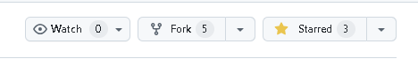
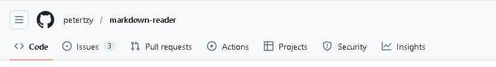

# Contributing to Markdown Reader

Thank you for your interest in contributing to **Markdown Reader**! We welcome contributions of all kinds, including bug reports, feature suggestions, pull requests, and documentation improvements.

---

## About the Project

Markdown Reader is a clean and intuitive Markdown reader with real-time preview support, dark mode toggle, and drag-and-drop file opening. It is compatible with macOS and Windows desktop environments and built with pure Python and Tkinter.

---

## How to Get Started

### 1. Clone the Repository

1. Fork the repo

2. Clone the repo
```bash
git clone https://github.com/(your-user-name)/markdown-reader.git
cd markdown-reader
```
3. Create A new branch
```bash
git checkout -b <new-branch>
```
4. Change the code
5. Commit the changes
6. Push
```bash
git push origin <new-branch>
```
7. Create a pull request
