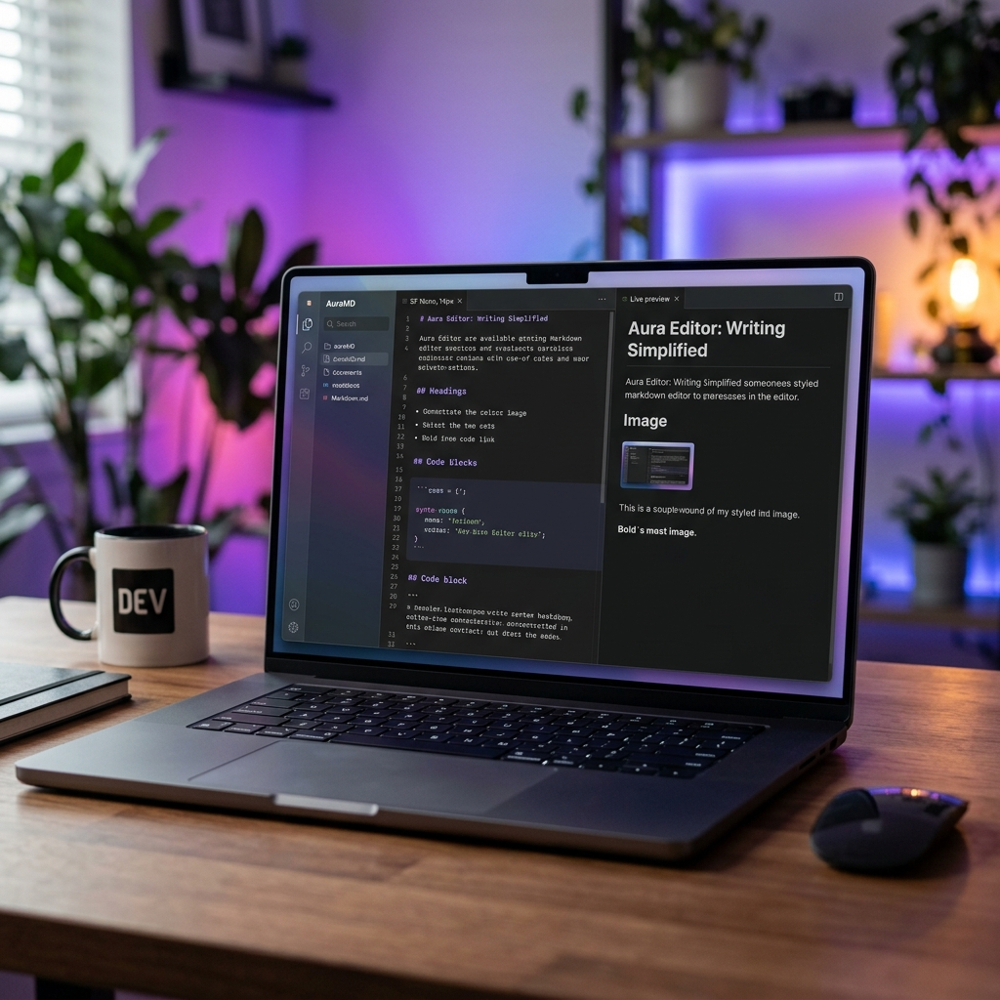

# Markdown Reader

Markdown Reader is a desktop Markdown editor and reader with a modern Next.js
interface, a local FastAPI backend, AI-assisted editing tools, and native
desktop packaging through Tauri.

The project previously shipped as a Python Tkinter application. That legacy UI
is still available for reference and fallback use, while the current
application is built around the Tauri desktop experience.



## Features

- Edit Markdown with a split editor and live preview experience.
- Open and work with Markdown files from a native desktop app window.
- Import content from Markdown, HTML, and PDF workflows supported by the
  backend.
- Use AI-assisted translation, summarization, table-of-contents generation,
  formatting, and code-block cleanup.
- Configure OpenAI Compatible, OpenRouter, OpenAI, and Anthropic providers from
  the app.
- Review AI suggestions before applying them, with support for rejection,
  rollback, and audit tracking.
- Export rendered documents through the local backend.
- Build a single packaged desktop app with the Python backend bundled as a
  Tauri sidecar.

## Architecture

Markdown Reader is split into three main layers:

```text
MarkdownReader/
├── backend/              # FastAPI app, routers, rendering, export, and AI APIs
├── frontend/             # Next.js UI and Tauri desktop shell
├── markdown_reader/      # Legacy Tkinter app logic kept for fallback/reference
├── scripts/              # Development and release helper scripts
├── tests/                # Python tests for backend and AI workflow logic
├── docs/                 # Additional project and platform notes
├── README_REFACTORING.md # Archived refactoring/migration README
└── README_OLD.md         # Legacy Tkinter-era README
```

In development mode, the app uses fixed local ports:

- Next.js frontend: `http://localhost:3000`
- FastAPI backend: `http://127.0.0.1:8000`

In packaged desktop mode, users launch only `Markdown Reader.app`. The Python
backend runs as a bundled sidecar and receives an available local port at
runtime, which avoids hard-coded desktop ports.

## Requirements

- Python 3.11 or newer
- [uv](https://docs.astral.sh/uv/)
- Node.js 18 or newer
- npm
- Rust and the Tauri system prerequisites for your platform

For Tauri setup details, follow the official prerequisite guide:

```text
https://tauri.app/start/prerequisites/
```

Some PDF and export features depend on native libraries through WeasyPrint and
related packages. Platform notes are available in:

- `docs/PrepareForMacUser.md`
- `docs/PrepareForWindowsUser.md`

## Installation

Clone the repository:

```bash
git clone https://github.com/petertzy/markdown-reader.git
cd markdown-reader
```

Install Python dependencies:

```bash
uv sync
```

Install frontend dependencies:

```bash
cd frontend
npm install
cd ..
```

Create the frontend environment file:

```bash
cp frontend/.env.local.example frontend/.env.local
```

The default development backend URL is:

```text
NEXT_PUBLIC_API_BASE_URL=http://127.0.0.1:8000
```

## Running the Desktop App in Development

Use the project helper script from the repository root:

```bash
./scripts/dev-tauri.sh
```

This script starts the FastAPI backend on port `8000`, lets Tauri start the
Next.js development server on port `3000`, and opens the native desktop window.

Useful development URLs:

- Swagger API docs: `http://127.0.0.1:8000/docs`
- ReDoc API docs: `http://127.0.0.1:8000/redoc`
- Backend health check: `http://127.0.0.1:8000/api/health`

Stop the development app with `Ctrl+C` in the terminal running the script.

## Running Services Separately

Most contributors should use `./scripts/dev-tauri.sh`, but the services can be
started manually when debugging.

Start the backend:

```bash
uv run uvicorn backend.main:app --host 127.0.0.1 --port 8000 --reload
```

Start the frontend:

```bash
cd frontend
npm run dev
```

Start Tauri development mode:

```bash
cd frontend
npm run tauri:dev
```

## Usage

After the desktop window opens, use Markdown Reader to:

- Open Markdown files for editing and preview.
- Work with multiple document tabs.
- Preview rendered Markdown while editing.
- Import supported document formats through the available file actions.
- Use AI tools from the AI panel to translate, summarize, format, or prepare
  document edits.
- Review suggested AI changes before applying them.
- Configure AI providers, models, base URLs, and API keys from the app settings.

API keys are saved through the system credential store when available. Provider
and model preferences are stored in the user's local app settings.

## Backend API

The FastAPI backend exposes these main route groups:

- `/api/files/*`
- `/api/markdown/*`
- `/api/ai/*`
- `/api/export/*`

Health endpoint:

```text
GET /api/health
```

During development, open `http://127.0.0.1:8000/docs` for interactive API
documentation.

## Building the Desktop App

Build the Python backend sidecar:

```bash
uv run pyinstaller markdown-reader-backend.spec
```

Copy the sidecar binary into the Tauri binary directory. For Apple Silicon
macOS:

```bash
cp dist/markdown-reader-backend frontend/src-tauri/binaries/markdown-reader-backend-aarch64-apple-darwin
chmod +x frontend/src-tauri/binaries/markdown-reader-backend-aarch64-apple-darwin
```

For other platforms, use the matching Rust target triple in the sidecar file
name.

Build the desktop bundle:

```bash
cd frontend
npx tauri build --bundles app
```

The macOS app bundle is created at:

```text
frontend/src-tauri/target/release/bundle/macos/Markdown Reader.app
```

### macOS Release Notes

Public macOS downloads need Developer ID signing and Apple notarization to open
without Gatekeeper warnings. The current beta build may be signed without
notarization.

If macOS blocks a local beta build after download, move it to Applications and
run:

```bash
xattr -dr com.apple.quarantine "/Applications/Markdown Reader.app"
open "/Applications/Markdown Reader.app"
```

For release packaging, use:

```bash
./scripts/package-macos-release.sh
```

## Legacy Tkinter App

The original Python/Tkinter application is still available:

```bash
uv run python app.py
```

Legacy documentation is archived in [README_OLD.md](README_OLD.md).

## Development

Install development tools:

```bash
uv sync --extra dev
```

Install git hooks:

```bash
uv run pre-commit install
```

Run Ruff checks:

```bash
uv run ruff check .
uv run ruff format --check .
```

Format Python code:

```bash
uv run ruff format .
```

Run the Python test suite:

```bash
uv run python -m unittest discover -s tests
```

Run a single test file:

```bash
uv run python -m unittest tests/test_ai_automation_logic.py
```

Build the frontend:

```bash
cd frontend
npm run build
```

## Dependency Management

Python dependencies are managed through `pyproject.toml` and `uv.lock`.

Use `uv sync` for normal setup. If dependencies change, regenerate the lockfile:

```bash
uv lock
```

CI uses locked installs, so commit both `pyproject.toml` and `uv.lock` whenever
dependency changes are intentional.

Frontend dependencies are managed with npm and `frontend/package-lock.json`.

## Documentation

Additional notes live in `docs/`:

- `docs/HostingStrategy.md`
- `docs/PrepareForMacUser.md`
- `docs/PrepareForWindowsUser.md`
- `docs/MathRenderingTestFile.md`

The temporary refactoring README has been preserved as
`README_REFACTORING.md`.

## Contributing

Contributions are welcome. A typical workflow is:

```bash
git checkout -b your-branch-name
uv sync --extra dev
cd frontend && npm install && cd ..
uv run pre-commit install
```

Before opening a pull request, run the relevant checks:

```bash
uv run ruff check .
uv run ruff format --check .
uv run python -m unittest discover -s tests
cd frontend && npm run build
```

Keep changes focused, update documentation when behavior changes, and include
tests for backend or workflow changes where practical.

## License

See [LICENSE](LICENSE.md).
